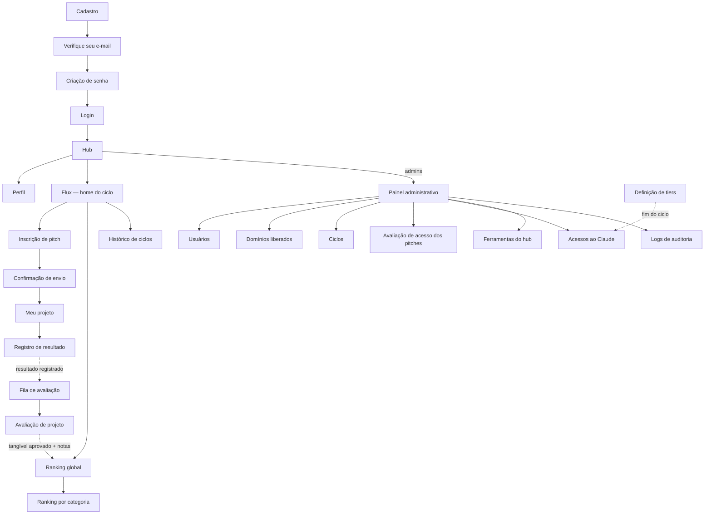

# Inventário de Telas — Portal Flux

**Briefing para o protótipo · v1.0 · 03/07/2026**
Base: Especificação de Requisitos v1.1 (as referências RF-xx e Px apontam para ela)

## 1. Como usar este documento

Este inventário é a ponte entre a especificação e o design: lista todas as telas do portal, o que cada uma mostra, quem acessa e para onde leva. Deve ser fornecido ao Claude Design junto com a especificação v1.1 como briefing do protótipo interativo. Diretrizes fixas: **desktop apenas** (decisão P8), identidade visual do **design system Tecnofink**, textos em **português simples** para público não técnico, pontuações sempre em **números inteiros** (decisão P5).

## 2. Mapa de navegação

## 3. Ciclo de vida do projeto (estados a representar visualmente)

| Estado | Quando | Observação para o design |
|---|---|---|
| Inscrito | Pitch enviado (RF-18/19) | Badge neutro; ação "excluir" visível até o fim das inscrições (RF-20) |
| Acesso definido | Admin definiu o tier de Claude do projeto (RF-21) | Exibir o tier concedido ao titular |
| Em execução | Após acesso definido, até o deadline | Mostrar dias restantes para o deadline |
| Atrasado | Deadline vencido sem resultado (RF-25) | Badge de alerta; sem desclassificação automática (decisão P9) |
| Resultado registrado | Titular enviou resultado + anexos (RF-23) | "Aguardando aprovação do comitê" (RF-24/26) |
| Avaliado | Tangível aprovado + notas completas (RF-26/27) | Entra/atualiza no ranking ao vivo (RF-32) |
| Congelado | Ciclo encerrado (RF-34) | Somente leitura, no histórico (RF-13) |
| Excluído | Titular excluiu até o fim das inscrições (RF-20) | Se já avaliado, admins são notificados |

## 4. Inventário de telas

### A. Autenticação (público, não logado)

| # | Tela | Conteúdo principal | Ações | Navega para |
|---|---|---|---|---|
| A1 | Login | E-mail e senha; links para cadastro e recuperação | Entrar | B1 · A2 · A5 |
| A2 | Solicitação de acesso | Nome, e-mail corporativo, empresa do grupo, cargo; validação de domínio (RF-01/02) | Enviar solicitação | A3; erro "domínio não autorizado" |
| A3 | Verifique seu e-mail | Confirmação de envio do link, validade de 30 min (RF-03) | Reenviar link | — |
| A4 | Criação de senha | Definição de senha via link; estado de link expirado | Criar senha | A1 |
| A5 | Esqueci minha senha | Campo de e-mail (RF-04) | Enviar link | A3 (variação) |
| A6 | Redefinição de senha | Nova senha via link de 30 min; estado de link expirado | Redefinir | A1 |

### B. Hub e perfil (todos os usuários logados)

| # | Tela | Conteúdo principal | Ações | Navega para |
|---|---|---|---|---|
| B1 | Hub (home) | Saudação; cards das ferramentas conforme perfil (v1: Flux, RF-09); atalho ao painel admin para administradores | Abrir ferramenta | C1 · B2 · E1 |
| B2 | Perfil | Foto, departamento, apresentação, aniversário; dados do cadastro com e-mail bloqueado (RF-07/08) | Editar e salvar | B1 |

### C. Flux — colaborador (todos os usuários)

| # | Tela | Conteúdo principal | Ações | Navega para |
|---|---|---|---|---|
| C1 | Home do Flux | Ciclo vigente (nome, datas, dias restantes); meus projetos com status; atalhos para inscrição e rankings; estado "nenhum ciclo ativo" | Inscrever pitch | C2 · C4 · C6 · C7 · C8 |
| C2 | Inscrição de pitch | Formulário RF-15: nome/setor (auto), nome do projeto, categoria (5 fixas, RF-16), gestor do projeto (seleção de usuários), tangível estimado em R$/ciclo com conversor mensal (decisão P6), intangíveis (multi-seleção da taxonomia), deadline limitado ao ciclo (decisão P3), justificativa | Revisar e enviar | C3 |
| C3 | Confirmação de envio | Resumo do pitch + aviso de não-edição (RF-18) | Confirmar / voltar | C4 |
| C4 | Meu projeto (detalhe) | Pitch em leitura; estado do ciclo de vida (seção 3); tier definido; prazo | Registrar resultado; excluir pitch (RF-20) | C5 |
| C5 | Registro de resultado | Tangível realizado (R$/ciclo), intangíveis observados, descrição, upload de anexos (RF-23) | Enviar para aprovação | C4 |
| C6 | Ranking global | Tabela ao vivo: posição, colaborador, projeto, critérios e pontos inteiros (RF-32/33); nota de recálculo retroativo do tangível | Alternar para categorias | C7 · C8 |
| C7 | Ranking por categoria | Destaques por categoria (5 cards, como na apresentação) | — | C6 |
| C8 | Histórico de ciclos | Lista de ciclos encerrados → ranking congelado (RF-13/34) | Abrir ciclo | C6 (modo histórico) |

### D. Flux — comitê (avaliadores: Marcos, Emilio, Thomas)

| # | Tela | Conteúdo principal | Ações | Navega para |
|---|---|---|---|---|
| D1 | Fila de avaliação | Projetos com resultado registrado aguardando o comitê | Abrir avaliação | D2 |
| D2 | Avaliação de projeto | Pitch + resultado + anexos; aprovação do tangível (RF-26); minhas notas 0–5 para Intangível, Impacto e Alcance (RF-27) | Aprovar tangível; salvar notas | D1 |
| D3 | Definição de tiers (fim de ciclo) | Colaboradores com desempenho do ciclo; decisão Basic / Enterprise / sem acesso para o próximo ciclo (RF-35) | Registrar decisão | E6 |

### E. Administração (Daniel e Marcos)

| # | Tela | Conteúdo principal | Ações | Navega para |
|---|---|---|---|---|
| E1 | Painel administrativo | Visão geral: pitches aguardando tier, ciclo vigente, alertas de colaboradores sem projeto (RF-36) | — | E2–E8 |
| E2 | Usuários | Lista com papéis e status; ativar/desativar (RF-06/38) | Editar papel; desativar | — |
| E3 | Domínios liberados | Lista de domínios autorizados (RF-02) | Adicionar / remover | — |
| E4 | Ciclos | Criar/editar ciclo (datas, RF-11); encerrar ciclo → congela ranking (RF-34) | CRUD; encerrar | — |
| E5 | Avaliação de acesso dos pitches | Fila de pitches inscritos; definição do limite/tier de Claude por projeto (RF-21) | Definir tier | — |
| E6 | Acessos ao Claude | Por colaborador: tier atual, decisão do próximo ciclo, status pendente/aplicado (RF-35); relatório de quem está sem projeto (RF-36) | Marcar como aplicado | — |
| E7 | Ferramentas do hub | CRUD: nome, descrição, ícone, rota, perfis com acesso (RF-10) | CRUD | — |
| E8 | Logs de auditoria | Trilha: quem, o quê, quando (RF-39, decisão P7) | Filtrar | — |

## 5. E-mails transacionais (RF-37 — desenhar como templates simples)

| # | E-mail | Gatilho | Destinatário | CTA |
|---|---|---|---|---|
| M1 | Verificação de e-mail | Solicitação de acesso | Solicitante | Criar senha (link 30 min) |
| M2 | Redefinição de senha | Esqueci minha senha | Usuário | Redefinir senha (link 30 min) |
| M3 | Confirmação de inscrição | Pitch enviado | Titular | Ver meu projeto |
| M4 | Lembrete de deadline | 7 dias e 1 dia antes (decisão P4) | Titular | Registrar resultado |
| M5 | Avaliação pendente | Resultado registrado | Comitê | Abrir fila de avaliação |
| M6 | Ranking do ciclo | Publicação/encerramento | Todos | Ver ranking |
| M7 | Pitch avaliado excluído | Exclusão pós-avaliação (RF-20) | Administradores | Rever acessos ao Claude |

## 6. Estados vazios e de erro a desenhar

Nenhum ciclo ativo (C1) · colaborador sem projetos (C1) · ranking vazio no início do ciclo (C6) · link expirado (A4/A6) · domínio não autorizado (A2) · projeto atrasado (C4, badge + aviso) · resultado aguardando aprovação (C4) · conta desativada (mensagem no login) · fila de avaliação vazia (D1).

## 7. Prioridade sugerida para o protótipo

- **P0 — fluxo do colaborador e rankings** (A1→B1→C1→C2→C3→C4→C5 + C6/C7): é o coração do programa e a peça de maior visibilidade para a diretoria.
- **P1 — fluxo do comitê** (D1→D2, D3).
- **P2 — administração** (E1–E8): pode entrar como telas navegáveis mais simples.
- E-mails (M1–M7) como wireframes de template, sem interação.

## 8. Dados fictícios para o protótipo

Usar os personagens e projetos da apresentação do programa (Ana Lima, Rafael Costa, Julia Santos, Pedro Melo, Carla Ferreira, Marcos Freitas, Lara Mendes) com pontuações **recalculadas pelas regras oficiais da seção 5 da especificação v1.1** — notas do comitê inteiras e nota final sem casas decimais (o projeto da Ana Lima fecha em 93 pts). Ciclo de exemplo: "Ciclo 1 · 14/07/2026 a 01/11/2026".
